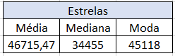
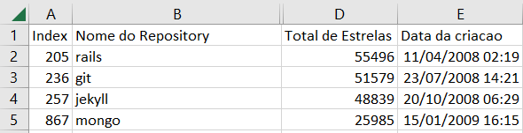
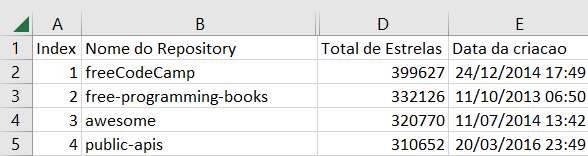

# 📈 Relatório da Análise de repositorios populares no GitHub 

## Introdução
O presente relatório visa observar e analisar as principais características de sistemas populares no GitHub com o maior número de estrelas. 
As hipóteses levantadas foram:
* [H1] **Hipótese sobre o número de estrelas:** Repositórios mais antigos possuem mais estrelas, pois tiveram mais tempo de ganhar popularidade.
* [H2] **Hipótese sobre Linguagem de Programação:** As 3 linguagens mais populares dos repositórios são JavaScript, Python e C#.
* [H3] **Hipótese sobre Issues fechadas:** Repositórios mais populares possuem um maior percentual de issues fechadas, indicando uma manutenção ativa.

## Metodologia:
Inicialmente, para extrair as informações foi utilizada a API GraphQL afim de coletar os dados dos repositórios mais populares, levando em consideração o maior número de estrelas e de modo ordenado decrescente. Além disso, também foram extraídas outras informações importantes do repositório como data de criação, data de última atualização, total de Issues e Issues Fechadas, idade, total de pull requestes, total de releases, linguagem primária e percentual de Issues Fechadas. Por fim, informações pesquisadas foram organizadas e armazenadas em um arquivo CSV.

Posteriormente, para a análise dos dados foram realizados alguns cálculos considerando valores medianos e contagem de certas categorias. Para isso foram realizadas manipulações dos dados no Excel para extração das informações.

Cálculos e fórmulas utilizados no excel:

**- Verificar dados de estrelas:**
* =MÉDIA(D2:D1001) 
* =MED(D2:D1001) 
* =MODO(D2:D1001) 
- Ordenado os dados de acordo com o ano de criação e quantidade de estrelas.

**- Verificar a hipótese de linguagens de programação**

Foi criada uma tabela dinâmica dos dados de Linguagens Primárias e odernada do maior para o menor.

## Resultados Obtidos 
- Mediana de Estrelas: Foi calculada a mediana do total de estrelas para conferir se os repositórios populares tem mais/menos estrelas do que a média.
Posteriormente foi filtrado os dados pela data de criação e comparado os dados com maior quantidade de estrelas.

- Cálculo da média, mediana e moda das estrelas 

- imagem dos dados ordenados pela data de criação (4 repositórios mais antigos)

- imagem dos dados ordenados pela quantidade de estrelas (4 repositórios com maior quantidade)

- Contagem de Linguagens: Foi calculada a frequência de cada linguagem primária nos repositórios analizados. Os resultados obtidos foram: Python (163 repositórios), JavaScript (157 repositórios) e TypeScript(132 repositórios).
A linguagem C# ficou em 8º lugar com 51 repositórios. 

| Linguagens Primárias | Quantidade de Repositórios |
|----------------------|-----------------------------|
| Python               | 163                         |
| JavaScript           | 157                         |
| TypeScript           | 132                         |
| No primary language  | 110                         |
| Go                   | 75                          |
| Java                 | 59                          |
| C++                  | 51                          |
| Rust                 | 36                          |
| C                    | 24                          |
| Shell                | 23                          |
| Jupyter Notebook     | 21                          |
| HTML                 | 18                          |
| Ruby                 | 14                          |
| C#                   | 14                          |
| Swift                | 13                          |
| Kotlin               | 10                          |
| PHP                  | 9                           |
| CSS                  | 8                           |
| MDX                  | 6                           |
| Vue                  | 6                           |
| Dart                 | 5                           |
| Vim Script           | 4                           |
| Markdown             | 4                           |
| Clojure              | 4                           |
| Dockerfile           | 3                           |
| TeX                  | 3                           |
| Batchfile            | 2                           |
| Svelte               | 2                           |
| Objective-C          | 2                           |
| Scala                | 2                           |
| Makefile             | 2                           |
| Haskell              | 2                           |
| Zig                  | 2                           |
| Assembly             | 2                           |
| Lua                  | 2                           |
| Elixir               | 1                           |
| Roff                 | 1                           |
| Less                 | 1                           |
| Nunjucks             | 1                           |
| V                    | 1                           |
| LLVM                 | 1                           |
| Astro                | 1                           |
| Jinja                | 1                           |
| SCSS                 | 1                           |
| Julia                | 1                           |
|Total Geral	       |1000                         |

## Discussão: Hipóteses X Resultados Obtidos

Em relação a hipótese 1, sobre o número de estrelas, a hipótese foi refutada. Isso porque o  repositório com o maior número de estrelas, freeCodeCamp, foi criado em 24/12/2014 e possui 399627 estrelas.
Já o repositório mais antigo, Rails, foi criado em 11/04/2008 e possui 55496 estrelas.
Além disso outros repositórios mais antigos também não possuem o maior número de estrelas como o git, jekyll e mongo. Desse modo, não é possível abordar a hipótese de que 'repositórios mais antigos possuem mais estrelas, pois tiveram mais tempo de ganhar popularidade'.

Em relação a hipóteste 2 sobre as linguagens de programação, o resultado foi parcialmente confirmado devido o Python e o Javascript estarem nos dos 3 primeiros no ranking.

