# 📈 Relatório da Análise de repositorios populares no GitHub 

## Introdução
O presente relatório visa analisar as principais características dos 1000 repositórios mais populares no GitHub. O estudo busca entender como esses sistemas são desenvolvidos, a frequência com que recebem contribuições externas, a regularidade dos lançamentos de novas versões, entre outros aspectos. Para isso, foram definidos os seguintes questionamentos de pesquisa:
* **RQ 01.** Sistemas populares são maduros/antigos?
* **RQ 02.** Sistemas populares recebem muita contribuição externa?
* **RQ 03.** Sistemas populares lançam releases com frequência?
* **RQ 04.** Sistemas populares são atualizados com frequência?
* **RQ 05.** Sistemas populares são escritos nas [linguagens mais populares](https://octoverse.github.com/)?
* **RQ 06.** Sistemas populares possuem um alto percentual de issues fechadas?
* **RQ 07:** Sistemas escritos em linguagens mais populares recebem mais contribuição externa, lançam mais releases e são atualizados com mais frequência?

Para responder a essas perguntas, foram formuladas as seguintes hipóteses:
* **[H1] Hipótese sobre o número de estrelas:** Repositórios mais antigos possuem mais estrelas, pois tiveram mais tempo de ganhar popularidade.
* **[H2] Hipótese sobre Linguagem de Programação:** As 3 linguagens mais populares dos repositórios são JavaScript, Python e C#.
* **[H3 - RQ01] Hipótese sobre maturidade:** Repositórios mais populares são mais maduros, uma vez que sistemas antigos têm mais tempo para ganhar reconhecimento, desenvolver funcionalidades e aumentar sua comunidade. 
* **[H4 - RQ02] Hipótese sobre contribuição externa:** Sistemas populares recebem um maior número de pull requests de contribuidores externos, possuindo maior engajamento da comunidade.
* **[H5 - RQ03] Hipótese sobre frequência de releases:** Repositórios populares tendem a lançar releases com maior frequência para manter o engajamento da comunidade de interesse.
* **[H6 - RQ04] Hipótese sobre frequência de atualizações:** Os sitemas populares são atualizados com frequência, já que a manutenção é importante para manter a popularidade e relevância do projeto além de garantir que esse repositório está em constante evolução.
* **[H7 - RQ05] Hipótese sobre linguagens de programação:** Os sistemas mais populares são escritos nas linguagens mais populares, a linguagem facilita a popularidade do projeto, já que mais pessoas terão o conhecimento da linguagem para desenvolver e melhorar o projeto.
* **[H8 - RQ06] Hipótese sobre issues fechadas:** Os sistemas mais populares possuem um grande percentual de issues fechadas, o que permite que ele tenha uma menor quantidade de bugs e seja mais eficiente e popular.
* **[H9 - RQ07] Hipótese sobre a relação entre popularidade de linguagens e contribuição externa:** A quantidade de desenvolvedores que tem conhecimento em linguagens populares é maior, o que faz com que tenha mais pessoas aptas a evoluir o sistema e lançar novas versões do mesmo, mantendo-os atualizados, portanto possuem maior contribuição externa do que as demais linguagens.

## Metodologia:
Inicialmente, para extrair as informações foi utilizada a API GraphQL afim de coletar os dados dos repositórios mais populares, levando em consideração o maior número de estrelas e de modo ordenado decrescente. Além disso, também foram extraídas outras informações importantes do repositório como data de criação, data de última atualização, total de Issues e Issues Fechadas, idade, total de pull requestes, total de releases, linguagem primária e percentual de Issues Fechadas. Por fim, informações pesquisadas foram organizadas e armazenadas em um arquivo CSV.

Posteriormente, para a análise dos dados foram realizados alguns cálculos considerando valores medianos e contagem de certas categorias. Para isso foram realizadas manipulações dos dados no Excel para extração das informações.

Cálculos e fórmulas utilizados no excel:

**- Verificar dados de estrelas:**
* =MÉDIA(D2:D1001) 
* =MED(D2:D1001) 
* =MODO(D2:D1001) 
- Ordenado os dados de acordo com o ano de criação e quantidade de estrelas.

**- Verificar a hipótese de linguagens de programação**

Foi criada uma tabela dinâmica dos dados de Linguagens Primárias e odernada do maior para o menor.

## Resultados Obtidos 
- Mediana de Estrelas: Foi calculada a mediana do total de estrelas para conferir se os repositórios populares tem mais/menos estrelas do que a média.
Posteriormente foi filtrado os dados pela data de criação e comparado os dados com maior quantidade de estrelas.

- Cálculo da média, mediana e moda das estrelas 
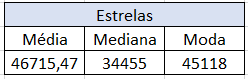

- Dados ordenados pela data de criação (4 repositórios mais antigos)
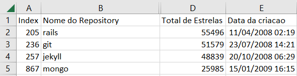

- Dados ordenados pela quantidade de estrelas (4 repositórios com maior quantidade)
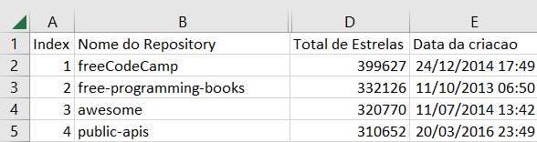

- Contagem de Linguagens: Foi calculada a frequência de cada linguagem primária nos repositórios analizados. Os resultados obtidos foram: Python (163 repositórios), JavaScript (157 repositórios) e TypeScript(132 repositórios).
A linguagem C# ficou em 8º lugar com 51 repositórios. 

| Linguagens Primárias | Quantidade de Repositórios |
|----------------------|-----------------------------|
| Python               | 163                         |
| JavaScript           | 157                         |
| TypeScript           | 132                         |
| No primary language  | 110                         |
| Go                   | 75                          |
| Java                 | 59                          |
| C++                  | 51                          |
| Rust                 | 36                          |
| C                    | 24                          |
| Shell                | 23                          |
| Jupyter Notebook     | 21                          |
| HTML                 | 18                          |
| Ruby                 | 14                          |
| C#                   | 14                          |
| Swift                | 13                          |
| Kotlin               | 10                          |
| PHP                  | 9                           |
| CSS                  | 8                           |
| MDX                  | 6                           |
| Vue                  | 6                           |
| Dart                 | 5                           |
| Vim Script           | 4                           |
| Markdown             | 4                           |
| Clojure              | 4                           |
| Dockerfile           | 3                           |
| TeX                  | 3                           |
| Batchfile            | 2                           |
| Svelte               | 2                           |
| Objective-C          | 2                           |
| Scala                | 2                           |
| Makefile             | 2                           |
| Haskell              | 2                           |
| Zig                  | 2                           |
| Assembly             | 2                           |
| Lua                  | 2                           |
| Elixir               | 1                           |
| Roff                 | 1                           |
| Less                 | 1                           |
| Nunjucks             | 1                           |
| V                    | 1                           |
| LLVM                 | 1                           |
| Astro                | 1                           |
| Jinja                | 1                           |
| SCSS                 | 1                           |
| Julia                | 1                           |
| Total Geral	       |1000                         |

A partir da análise dos 1000 repositórios mais populares do GitHub (maior número de estrelas) foram elaboradas respostas para cada uma das perguntas de pesquisa apresentadas previamente
* **RQ 01. Sistemas populares são maduros/antigos?**
       
    **Métrica:** Idade do repositório (calculado a partir da data de sua criação)   

    **Resultado:** 2962 dias ≈ 8 anos e 1 mês
    
    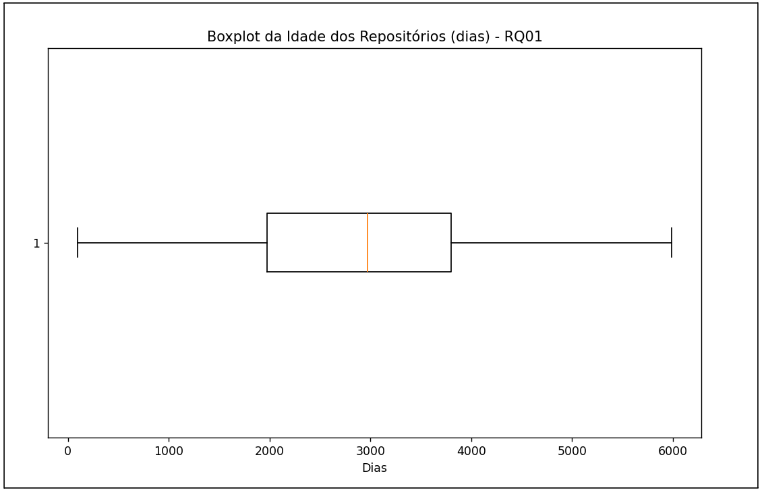

    **Discussão do resultado:** A análise dos dados revela que a maioria dos projetos tem uma idade média de cerca de 8 anos, o que indica que são bastante antigos, maduros e estáveis. Projetos mais antigos geralmente possuem uma base sólida de código e uma comunidade bem estabelecida, sugerindo robustez e confiabilidade.

* **RQ 02. Sistemas populares recebem muita contribuição externa?**
       
    **Métrica:** Total de pull requests aceitas  

    **Resultado:** 973 pull requests

    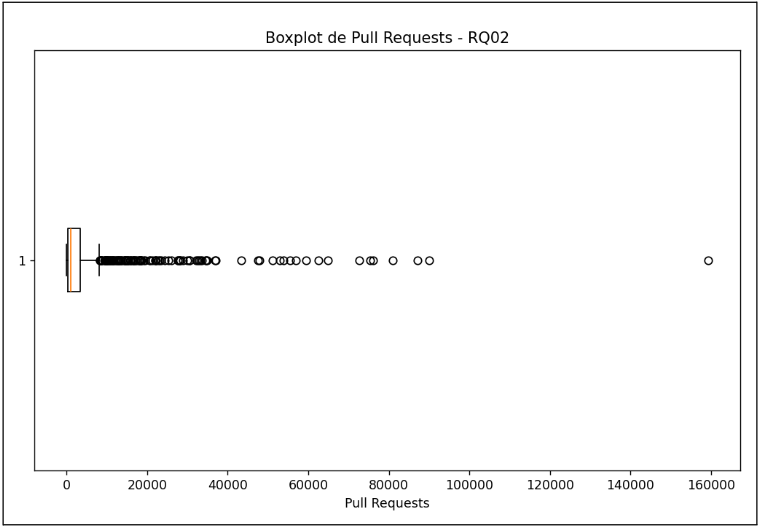
    
    **Discussão do resultado:** O número médio de pull requests é de aproximadamente 973 por projeto, o que mostra uma comunidade ativa e colaborativa, o que mostra que os projetos tem temas interessantes que chamam a atenção dos desenvolvedores.

* **RQ 03. Sistemas populares lançam releases com frequência?**
       
    **Métrica:** Total de releases 

    **Resultado:** 30,5 releases

    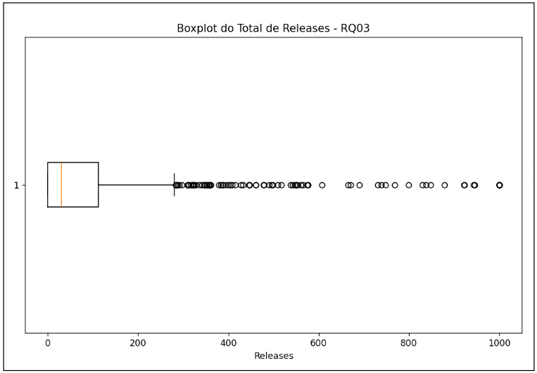
    
    **Discussão do resultado:** A mediana de releases é de 30,5, indicando que os projetos recebem atualizações regulares. Isso mostra que os desenvolvedores estão engajados em lançar novas versões e corrigir problemas, mantendo o projeto relevante e eficiente.

* **RQ 04. Sistemas populares são atualizados com frequência?**
       
    **Métrica:** Tempo até a última atualização (calculado a partir da data de última atualização)

    **Resultado:** 7 dias
    
    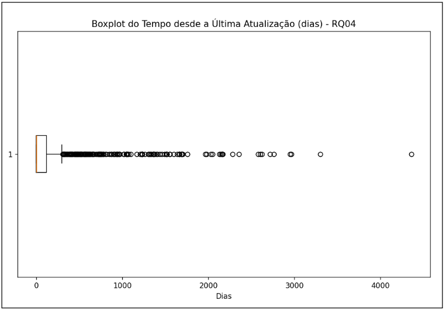

    **Discussão do resultado:** O tempo médio desde a última atualização é de apenas 7 dias, sugerindo que os projetos são mantidos ativamente. Esse curto intervalo demonstra que os desenvolvedores estão comprometidos em resolver problemas e melhorar o software de forma contínua, sem sinais de abandono. 

* **RQ 05. Sistemas populares são escritos nas linguagens mais populares?**
       
    **Métrica:** Linguagem primária de cada um dos repositórios

    **Resultado:** 70,7% dos repositórios são escritos nas linguagens mais populares. A distribuição dos repositórios por linguagem é a seguinte:
    
   
    * Python: 163 repositórios
    * JavaScript: 157 repositórios
    * TypeScript: 132 repositórios
    * No prymary language: 110
    * Go: 75 repositórios
    * Java: 59 repositórios
    * C++: 51 repositórios
    * Rust: 36 respositórios
    * C: 24 repositórios
    * Shell: 23 repositórios
    * C#: 14 repositórios
   
    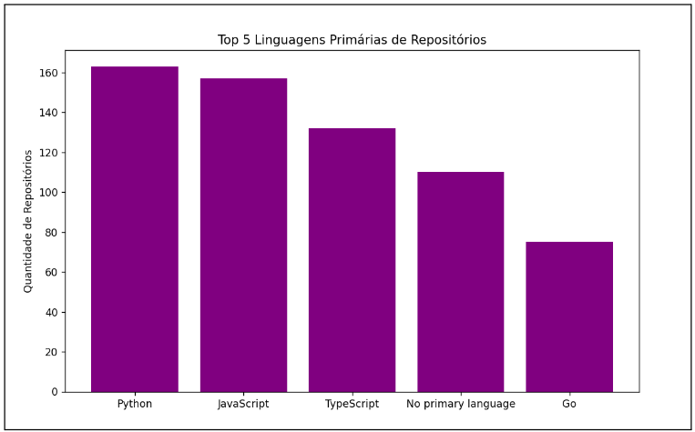
    
    **Discussão do resultado:** A análise revela que 70,7% dos repositórios populares são desenvolvidos nas linguagens consideradas as mais populares utilizadas no github. 

* **RQ 06. Sistemas populares possuem um alto percentual de issues fechadas?**
       
    **Métrica:** Razão entre número de issues fechadas pelo total de issues Relatório Final.

    **Resultado:** 82,59% de issues fechadas nos repositórios.

    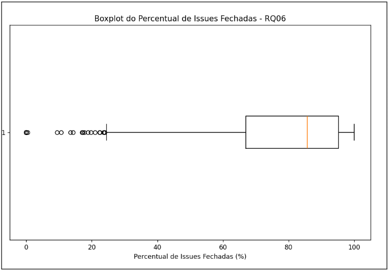
    
    **Discussão do resultado:** A análise revela que os repositórios populares apresentam uma razão de 82,59% entre o número de issues fechadas e o total de issues reportadas. Este percentual sugere que a maioria das issues relatadas são resolvidas, indicando um processo de manutenção eficiente e constante.

* **RQ 07. Sistemas escritos em linguagens mais populares recebem mais contribuição externa, lançam mais releases e são atualizados com maior frequência?**
       
    **Métrica:** Contribuições externas (total de pull requests), frequência de releases (total de releases) e frequência de atualizações (tempo médio até a última atualização)

    **Resultado:**

    * Linguagens Populares:
      * Mediana de Pull Requests: 1177
      * Mediana de Releases: 47
      * Mediana do Tempo desde a Última Atualização (dias): 4

    * Outras Linguagens:
        * Mediana de Pull Requests: 562
        * Mediana de Releases: 0
        * Mediana do Tempo desde a Última Atualização (dias): 31 

        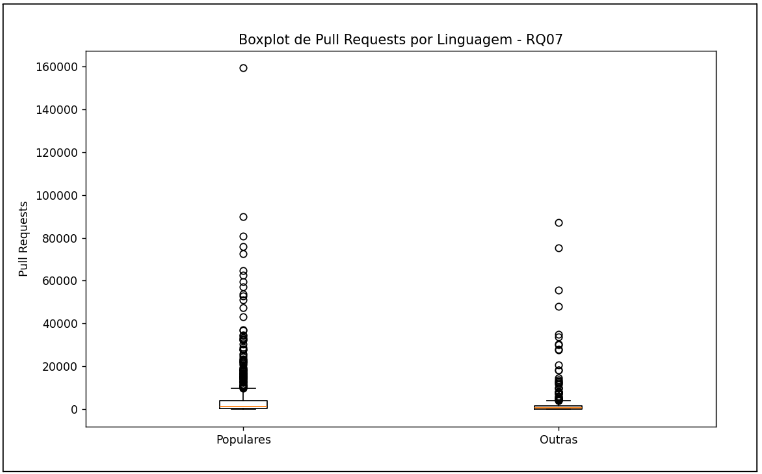
        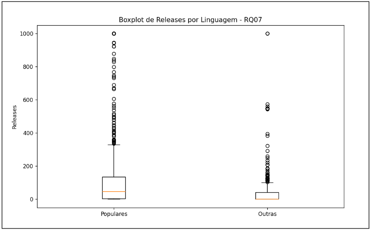
        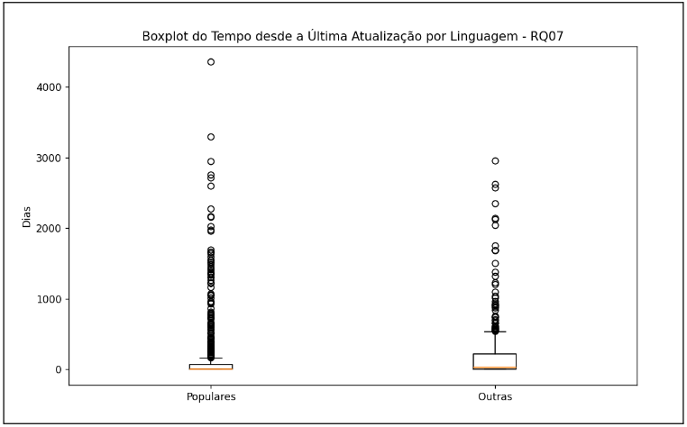
    
    **Discussão do resultado:** : A análise mostra que sistemas escritos em linguagens populares apresentam medições superiores em termos de contribuição externa, frequência de lançamentos de novas versões e atualização. Para sistemas desenvolvidos em linguagens populares, a mediana de pull requests é de 1177, o que é quase o dobro da mediana de 562 observada para sistemas em outras linguagens. Além disso, esses projetos também têm uma mediana de 47 releases, em contraste com 0 para sistemas em outras linguagens, o que indica uma atividade de lançamento muito mais frequente e regular.

## Discussão: Hipóteses X Resultados Obtidos

Em relação à hipótese 1, sobre o número de estrelas, a hipótese foi refutada. Isso porque o  repositório com o maior número de estrelas, freeCodeCamp, foi criado em 24/12/2014 e possui 399627 estrelas.
Já o repositório mais antigo, Rails, foi criado em 11/04/2008 e possui 55496 estrelas.
Além disso outros repositórios mais antigos também não possuem o maior número de estrelas como o git, jekyll e mongo. Desse modo, não é possível abordar a hipótese de que 'repositórios mais antigos possuem mais estrelas, pois tiveram mais tempo de ganhar popularidade'.

Em relação à hipóteste 2 sobre as linguagens de programação, o resultado foi parcialmente confirmado devido o Python e o Javascript estarem nos dos 3 primeiros no ranking.
No entanto, o terceiro lugar não foi ocupado por uma das linguagens previamente especulada.

Em relação à hipótese 3, referente ao RQ01, a hipótese foi confirmada visto que a análise dos dados aborda que a maioria dos projetos possuem idade média de 8 anos, indicando que são antigos, maduros e estáveis o que proporcionam uma base sólida de código, sugerindo robustez e confiabilidade. Além disso, o gráfico boxplot indica que a maioria dos projetos possuem uma idade mediana de aproximadamente 3000 dias (8 anos), o que indica maturidade. A questão de confiabilidade desses repositórios são sugeridas por essa base sólida de código, refletida pela dispersão mais baixa de idades em comparação com projetos mais recentes, que têm maior variabilidade.

Em relação à hipótese 4, referente ao RQ02, a hipótese foi validada devido o número médio de pull requests ser de aproximadamente 973 por projeto, com uma ampla dispersão o que indica que muitos repositórios recebem uma grande quantidade de contribuições externas. Dessa forma, indica que a comunidade de desenvolvedores é ativa e colaborativa fornecendo melhorias para os repositórios.

Em relação à hipótese 5, referente ao RQ03, a hipótese foi comprovada pela mediana de releases ser de 30,5. Isso aponta que os projetos possuem atualizações frequentes e  que os programadores são incentivados a lançar novas versões, corrigindo erros, elaborando melhorias e mantendo o reposótio relevante e atualizado.

Em relação à hipótese 6, referente ao RQ04, a hipótese foi sustentada devido o tempo médio de atualização dos repositórios ser de 7 dias. Isso indica que a frequência de novas versões é alta, mostrando que os desenvolvedores estão aptos para melhorias contínuas no sistema afim de melhorar sempre que possível.

Em relação à hipótese 7, referente ao RQ05, a hipótese foi verificada devido a quantidade de 70,7% dos respositórios utilizarem as linguagens mais populares como Python (163 repositórios), JavaScript (163 repositórios) e TypeScript (157 repositórios.)

Em relação à hipótese 8, referente ao RQ06, a hipótese foi validada devido a razão de 82,59% entre o número de issues fechadas e o total de issues reportadas. Desse modo, é notório que as issues são resolvidas e finalizadas demonstrando-se que os repositórios possuem um bom número de ações realizadas como manutenções constantes.

Em relação à hipótese 9, referente ao RQ07, a hipótese foi comprovada pois os resultados mostraram que os sistemas escritos em linguagens mais populares receberam significativamente mais contribuições externas e releases do que os de outras linguagens.